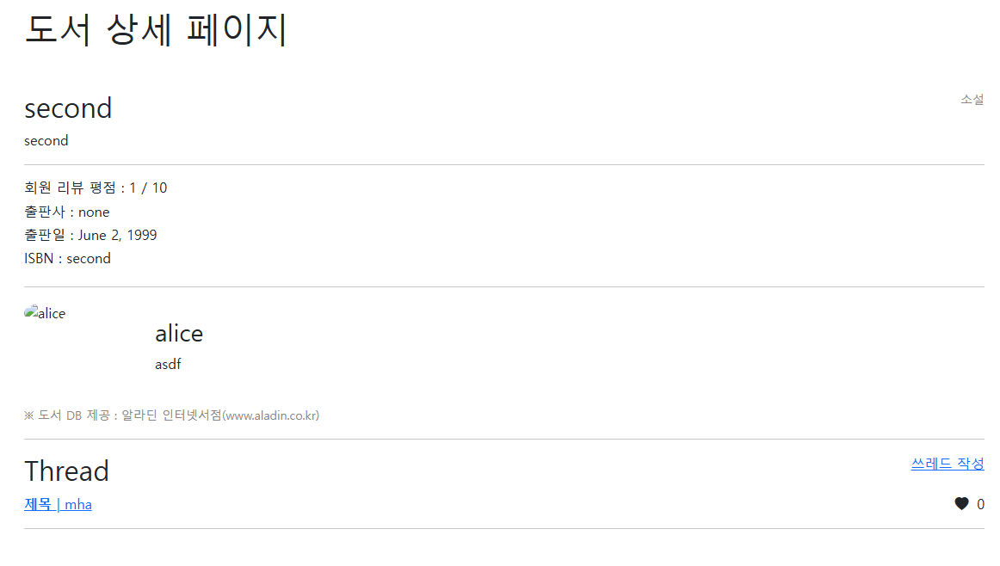
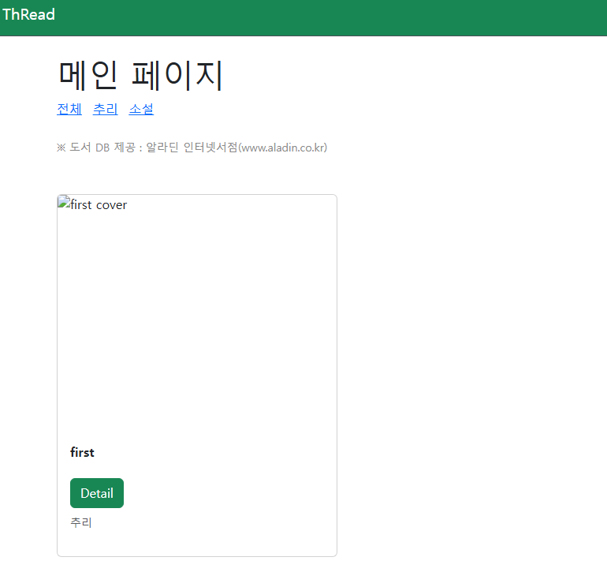
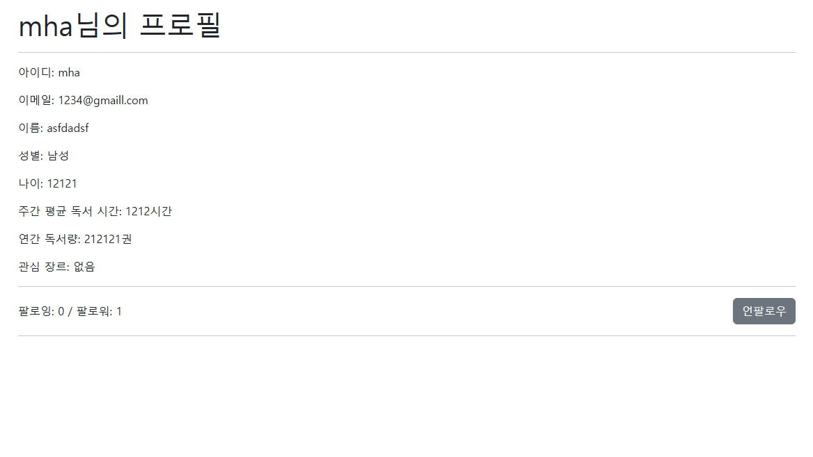
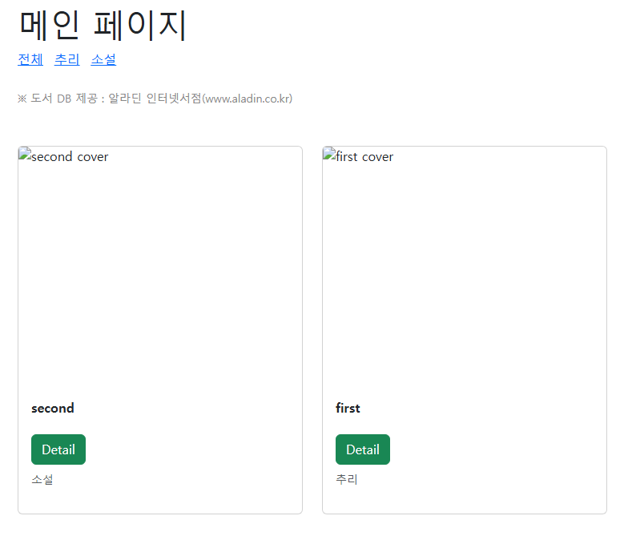
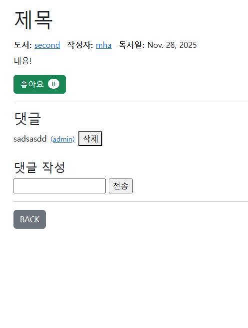

# 07-pjt-team8

## Branch 생성 원칙
### master
- 기본 branch. 프로젝트의 가장 최신 버전을 관리
### develop
- project 내부의 app 단위로 master branch에서 분기되는 branch
- 브랜치 이름은 devlop/app_name으로 작성 (ex. develop/libraries)
### feature
- devlop 브랜치에서 분기되어 앱 내에서 독립적으로 개발되는 기능들을 분리
- feature/기능으로 브랜치 생성 (ex. feature/login)

## Commit 제목 원칙
### 주의사항: 커밋 메시지의 제목은 영어로 작성함을 원칙으로 한다
1. 태그 
태그는 '[tag]'와 같이 작성한다.

| 타입 | 설명 |
|---|---|
| feat | 새로운 기능 추가 |
| add | 파일을 생성한 경우 |
| remove | 파일을 삭제만 한 경우 |
| fix | 버그 수정 |
| docs | 문서 수정 |
| style | 코드 스타일 변경 (코드 포매팅, 세미콜론 누락 등) 기능 수정이 없는 경우 |
| design | 사용자 UI 디자인 변경 (CSS 등) |
| test | 테스트 코드, 리팩토링 테스트 코드 추가 |
| refactor | 코드 리팩토링 |
| build | 빌드 파일 수정 |
| ci | CI 설정 파일 수정 |
| perf | 성능 개선 |
| chore | 빌드 업무 수정, 패키지 매니저 수정 (gitignore 수정 등) |
| rename | 파일 혹은 폴더명을 수정만 한 경우 |

2. 제목
- 태그와 제목은 띄어쓰기로 구분
- 첫 글자는 대문자로 작성
- 제목은 영문 기준 50글자 이하
- 명령문으로 작성
- 과거형으로 작성하지 않음
- 제목 끝에 마침표를 적지 않음

3. 본문
- 제목과 본문을 빈 행으로 구분
- 본문의 각 행은 영문 기준 72글자 이하
- '어떻게' 보다는 '무엇'과 '왜'를 중심으로 기술

## 원칙 수행 점검

- 브랜치 생성, 삭제 등 관리 미흡
  - 특히, 원격 repository에서 만든 브랜치를 로컬 브랜치와 연결하거나 삭제하는 등의 관리가 초반에 되지 원활히 수행되지 않음
  - 추후 브랜치 생성 시, git에서의 역할과 기능을 엄격히 구분하고 상호 합의 된 상태에서 프로젝트 시작하기

- 사소한 Commit 규칙이라도 점검하고 지키기
  - 제목의 첫자는 대문자로 하는 규칙이 지켜지지 않았음

## 실행 화면

이것은 문서의 내용입니다. 아래에 이미지를 삽입합니다.

## 느낀 점
- 신원호: 기능이 동작하는 시점에서 commit message 남겨두기
  - fix와 feat의 기능 구분이 되지 않았고 fix 이전의 코드를 추적하기 어려웠음.

- 문현아: git 사용에서 GUI에 익숙해 CLI 명령어를 소홀히 했음을 느낌. git에서 자주 사용하는 명령어를 정리하고 이후 git 사용에 활용할 예정

- 이강우: git branch 관리가 어렵다는 것을 느낌
  - branch 생성 및 기능 구현 전에, 팀원과 확실한 규칙 및 합의를 거쳐 필요한 branch만 생성하고 이용하는 것이 가장 간편하게 관리할 수 있는 것 같음